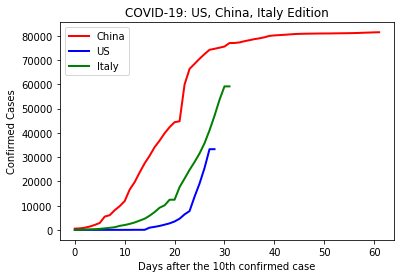
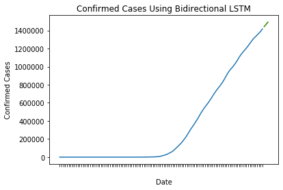
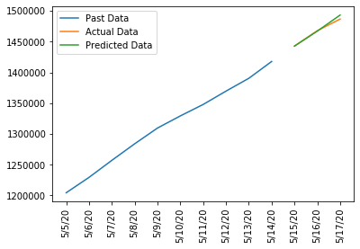

# COVID-19-LSTM

### Discussion
Originally located at [a different repository](https://github.com/dangural/CPE-695-Final-Project) for my ***CPE 695 Applied Machine Learning*** final project. This project analyzes not only COVID-19, but also SARS, H1N1, MERS, and Ebola. Check out the preliminary work.        

This repo extends the work and focuses on more on COVID-19 as there are more data points. 

### Abstract 
Due to the recent novel COVID-19 pandemic, there is a strong motivation to forecast or predict the number of confirmed cases for each geographic location. Forecasts based on statistical and mathematical models are imperative in finding the best interventions to limit the spread of the COVID-19 from human to human. This study is intended to utilize Long Short Term Memory (LSTM). LSTM constitutes the best example of a successful learning of order dependence in sequence prediction problems. Several types of LSTM were applied on the COVID-19 data set to in order predict  how many  cases  of  each  virus  will  spread  within the US.       

### Data Set 
This model uses [COVID-19 Data Repository](https://github.com/CSSEGISandData/COVID-19) by the Center of Systems Science and Engineering (CSSE) at Johns Hopkins University.       


### Getting Started 
1. Clone repository   
```bash
 git clone https://github.com/chloequinto/COVID-19-LSTM.git 
```

2. Retrieve Dataset   
&nbsp;&nbsp;&nbsp; Get the most current COVID-19 dataset from the link above and move data into src/data   

3. Start Jupyter Notebook  
```bash 
jupyter notebook
cd src/models 
```

4. Run Preprocessing  
5. Run Train and Test   

### Analysis  
##### Comparison of LSTMs
Previously, the work done in my final project only had COVID-19 dataset report up to the date of March 23rd. The group looked at vanilla LSTM, Stacked LSTM, and Bidirectional LSTM models. The group evaluated the models by calculating the loss function: mean squared error (MSE) and the root mean squred error (RMSE).   

  
<br>


<br/>
The group found that Vanilla LSTM gave a lower RMSE score. The group, therefore, used Vanilla LSTM to analyze COVID-19 data from China, Italy, and the US.    
 
| Model        | MSE           | RMSE  |
| ------------- |:-------------:| -----:|
| Vanilla LSTM     |107970            | 328.589 |
| Stacked LSTM     | 1.07524e+07      |   340.09 |
| Bidirectional LSTM |  1.77851e+06   |   1333.61|




--- 
After retrieving the most current covid-19 data from CSSE, I analyzed the different LSTM models and found that bidirectional LSTM works best.   

| Model        | MSE            | RMSE  |
| ------------- |:-------------:| :-----:|
| Vanilla LSTM     |8.85294e+07 | 9409.01|
| Stacked LSTM     | 6.36929e+09| 79807.9 |
| Bidirectional LSTM |4.00326e+07 | 6327.13|

###### Why did Bidirectional LSTM work better? 
&nbsp; &nbsp; &nbsp; Our dataset increased! Before, we only had covid data all the way up to March 23rd. Now, our dataset is up to May 17th. Since our data set was so small, we didn't need to apply more complex LSTM models.   


#### How does Bidirectional LSTM Work?
Bidirectional LSTM is trained using all available inputs in the past and the future within a specific time frame. 


###### Legend: 
X<sub>n</sub> represents the nth input
A represents ***forward*** recurrent network 
A' represents ***backward*** recurrent network 
y<sub>n</sub> represents the nth output

###### This network defines an acyclic graph:  
Forward sequence will compute x<sub>0</sub>... x<sub>4</sub>
Backward sequence will compute x<sub>4</sub>...x<sub>0</sub>

###### Activation function 
y<sup>t</sup> = g(W<sub>y</sub>[A<sup>t</sup>, A'<sup>t</sup>] + by)

#### Results on US COVID-19 
The following images shows the trajectory of confirmed cases in the US. I used a 3 day time step to find May 15th - May 17th confirmed cases. Batch size was set 1 and epoch was set to 20. 



Let's look a bit closer: 



Comparison of Confirmed and LSTM Predictions 
| Date        | Confirmed            | LSTM Predictions  | Absolute Difference |
| ------------- |:-------------:| :-----:|:-----: |
| 5/15/20     |1442824 |1442773| 51 |
| 5/16/20     | 1467820|1467130 | 690 |
| 5/17/20 |1486757|1493271|  6514 |


#### MSE and RMSE 

| MSE            | RMSE  | Mean | 
|:-------------:| :-----:| :----: | 
|14301377.806556901  |3781.71625146003 | 364899.452991453|


#### Ways to improve? 
- Would adding a dropout layer give a better accuracy?       
&nbsp; &nbsp; &nbsp; No, not in this case. While adding a drop out layer will prevent overfitting, adding a drop out layer to LSTM cells in this case, there will be a chance of forgetting something that's important.    
- Would changing the number of epochs make a difference?                
&nbsp; &nbsp; &nbsp; I addressed this question within train_and_test.ipynb and found that the loss function flatlines after 1 epoch. This could be due to multiple factors but it could be the generalization ability of the network. The network is not complicated or deep enough for the task. The data set starts on January and ends in May. If the time steps are 3 days, then that only leaves 50 datasets to analyze which is not a lot.    


#### Contributing 
This project welcomes contributions and suggestions. 
1. Open issues to discuss proposed changes 
2. Fork the repo and test local changes
3. Create pull request against staging branch 

#### Future Work 
- Analyze different countries
- Add test cases (in progress) 
